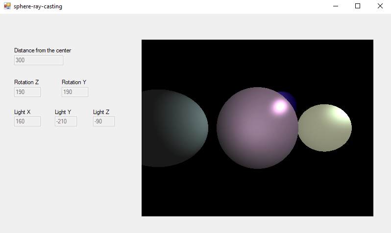

# sphere-ray-casting
This is a visualization of ray-casting in C# using WinForms.

This program utilizes ray-casting to render the scene. A ray is cast through each pixel of the frame.
Its coordinates on a frame (X and Y of a pixel) are transformed into coordinates in the 3D scene.
Each ray is tested for a possible intersection with the spheres. The color of resulting pixel comes from
the sphere which was first to intersect the ray. The color is calculated using Phong reflection model.
Each sphere has a different material coefficients and its resulting color and reflectivity are different.

The program intializes the scene with a few spheres, a point light and a camera.
The user can control both the location of the light source and the camera with keyboard.
Controls:
* `Right Arrow`  
  Turn around Z axis clockwise.
* `Left Arrow`  
  Turn around Z axis counterclockwise.
* `Up Arrow`  
  Turn around Y axis clockwise.
* `Down Arrow`  
  Turn around Y axis counterclockwise.
* `W`  
  Move the light source along X axis forward.
* `S`  
  Move the light source along X axis backward.
* `A`  
  Move the light source along Z axis backward.
* `D`  
  Move the light source along Z axis forward.
* `Z`  
  Move the light source along Y axis forward.
* `X`  
  Move the light source along Y axis backward.
* `Num Key 2`  
  Decrease the distance from the center of the scene.
* `Num Key 8`  
  Increase the distance from the center of the scene.

